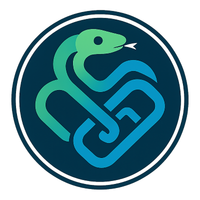

<div align="center">
    
    <h1>ChainLite</h1>
</div>
<div>
    <p>ChainLite combines LangChain and LiteLLM to provide an easy-to-use and customizable interface for large language model applications.</p>
    <p style="font-size: smaller;"><sup>*</sup> Logo is generated using DALL·E 3.</p>
</div>


## Installation

To install ChainLite, use the following steps:


1. Install ChainLite via pip:
    ```bash
    pip install https://github.com/stanford-oval/chainlite.git
    ```


1. Copy `llm_config.yaml` to your project and follow the instructions there to update it with your own configuration.

## Usage

Before you can use Chainlite, you can call the following function to load the configuration file. If you don't, ChainLite will use `llm_config.yaml` in the current directory (the directory you are running your script from) by default.

```python
from chainlite import load_config_file
load_config_file("./llm_config.yaml") # The path should be relative to the directory you run the script from, usually the root directory of your project
```

Make sure the corresponding API keys are set in environemnt variables with the name you specified in the configuration file, e.g. `OPENAI_API_KEY` etc.

Then you can use the following functions in your code:

```python
llm_generation_chain(
    template_file: str,
    engine: str,
    max_tokens: int,
    temperature: float = 0.0,
    stop_tokens=None,
    top_p: float = 0.9,
    postprocess: bool = False,
    bind_prompt_values: dict = {},
) # returns a LangChain chain the accepts inputs and returns a string as output
load_config_from_file(config_file: str)
pprint_chain() # can be used to print inputs or outputs of a LangChain chain.
write_prompt_logs_to_file(log_file: Optional[str]) # writes all instructions, inputs and outputs of all your LLM API calls to a jsonl file. Good for debugging or collecting data using LLMs
get_total_cost() # returns the total cost of all LLM API calls you have made. Resets each time you run your code.
```

## Full Example

`joke.prompt` with a 1-shot example:

```markdown
# instruction
Tell a joke about the input topic. The format of the joke should be a question and response, separated by a line break.

# distillation instruction
Tell a joke.

# input
Physics

# output
Why don't scientists trust atoms?
Because they make up everything!

# input
{{ topic }}
```

`main.py`:
```python
from chainlite import load_config_file
load_config_file("./chainlite_config.yaml")

async def tell_joke(topic: str):
    response = await llm_generation_chain(
        template_file="joke.prompt",
        engine="gpt-35-turbo",
        max_tokens=100,
    ).ainvoke({"topic": topic})
    print(response)

asyncio.run(tell_joke("Life as a PhD student")) # prints "Why did the PhD student bring a ladder to the library?\nTo take their research to the next level!"
write_prompt_logs_to_file("llm_input_outputs.jsonl")
```

Then you will have `llm_input_outputs.jsonl`:
```json
{"template_name": "joke.prompt", "instruction": "Tell a joke.", "input": "Life as a PhD student", "output": "Why did the PhD student bring a ladder to the library?\nTo take their research to the next level!"}
```

## Configuration

The `chainlite_config.yaml` file allows you to customize the behavior of ChainLite. Modify the file to set your preferences for the LangChain and LiteLLM integrations.

## Syntax Highlighting 
If you are using VSCode, you can install [this extension](https://marketplace.visualstudio.com/items?itemName=samuelcolvin.jinjahtml) and switch `.prompt` files to use the "Jinja Markdown" syntax highlighting.

## Contributing

We welcome contributions! Please follow these steps to contribute:

1. Fork the repository.
2. Create a new branch for your feature or bugfix.
3. Commit your changes.
4. Push the branch to your forked repository.
5. Create a pull request with a detailed description of your changes.

## License

ChainLite is licensed under the Apache-2.0 License. See the [LICENSE](LICENSE) file for more information.

## Contact

For any questions or inquiries, please open an issue on the [GitHub Issues](https://github.com/stanford-oval/chainlite/issues) page.

---

Thank you for using ChainLite!
